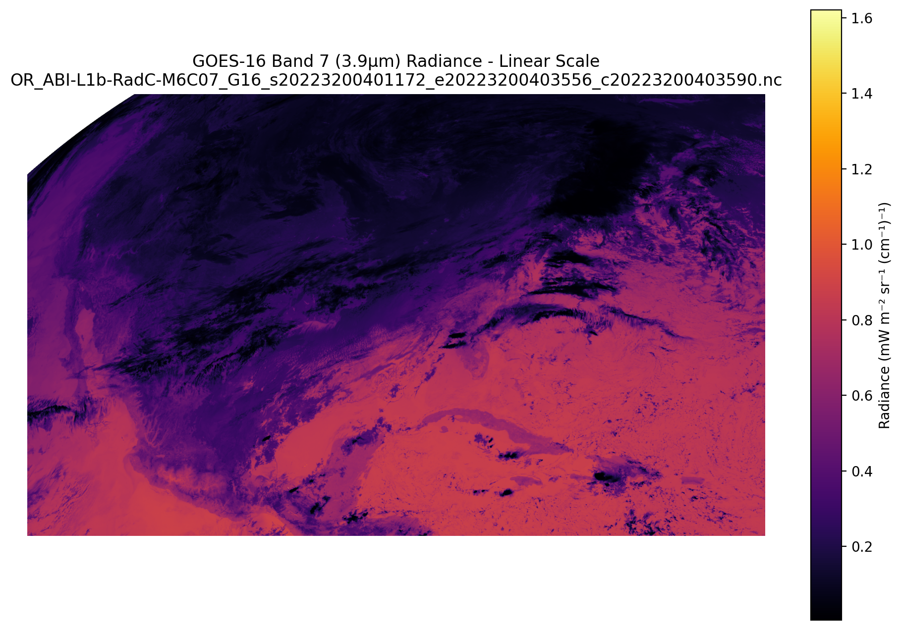

# GOES Satellite Rocket Launch Detection

This project uses NOAA GOES-16 satellite data to detect and analyze rocket launches using thermal anomaly detection. The project focuses on launches from October-December 2022.

## Data Source
NOAA GOES-16 CONUS data from AWS S3 (ABI-L1b-RadC product for raw radiance measurements)

## Understanding GOES NetCDF Files

The GOES satellite data is stored in NetCDF (Network Common Data Form) files with several important characteristics:

- Files contain a full radiance grid (typically 1500×2500 pixels) capturing infrared measurements
- Data is stored in the satellite's native fixed-grid coordinate system, not in latitude/longitude
- The x/y coordinates are in radians representing scanning angles from the satellite's perspective
- The primary data variable `Rad` contains radiance measurements in mW m⁻² sr⁻¹ (cm⁻¹)⁻¹
- Files include metadata describing the geographic coverage area (typically -152° to -53° longitude, 14° to 57° latitude)

A key challenge is that Earth coordinates (lat/lon) don't map directly to the satellite's internal coordinate system, requiring careful transformation.



## Tools

### inspect_netcdf.py

Analyzes the structure and content of GOES NetCDF files and outputs a JSON representation.

```bash
python inspect_netcdf.py <path_to_netcdf_file> [--output_dir OUTPUT_DIR]
```

#### Arguments

| Argument              | Description                                                   |
|-----------------------|---------------------------------------------------------------|
| `path_to_netcdf_file` | Path to the NetCDF file to visualize.                         |
| `--output_dir`        | *(Optional)* Directory to save the visualizations. Default: current directory. |

This tool is useful for understanding the variables, dimensions, and metadata contained in the NetCDF files.

### inspect_rad_grid.py

Visualizes the full radiance grid from a GOES NetCDF file with multiple visualization approaches.

```bash
python inspect_rad_grid.py <path_to_netcdf_file> [--output_dir OUTPUT_DIR]
```

#### Arguments

| Argument              | Description                                                   |
|-----------------------|---------------------------------------------------------------|
| `path_to_netcdf_file` | Path to the NetCDF file to visualize.                         |
| `--output_dir`        | *(Optional)* Directory to save the visualizations. Default: current directory. |


The script generates four visualizations:
1. Linear scale visualization of the full radiance grid
2. Log scale visualization to better show the dynamic range
3. Histogram of radiance values
4. Hotspot-enhanced visualization highlighting statistically significant thermal anomalies

These visualizations help identify potential rocket launches by highlighting unusually bright thermal signatures in the infrared data.